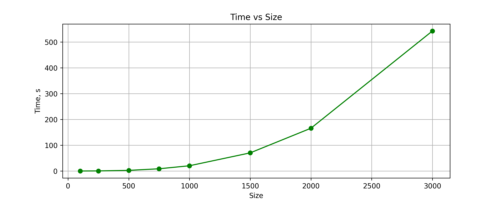

# Лабораторая работа №1 

## Задание: 
1. Написать программу на языке C/C++ для перемножения двух матриц. 
2. Исходные данные: файл(ы) содержащие значения исходных матриц.
3. Выходные данные: файл со значениями результирующей матрицы, время выполнения, объем задачи.
    Обязательна автоматизированная верификация результатов вычислений с помощью сторонних библиотек или стороннего ПО.

## Характеристики ЭВМ
1. CPU - AMD Ryzen 5 5500U
2. GPU - AMD Radeon Graphics 3.20 GHz
3. RAM 8,0 GB (7,8 GB)

#### Компилятор - msys64

## Результаты: 
1. сгенерированны матрицы в `matrix1_2` разных размеров
2. результат перемножение матриц в `matrix_res`
3. файл статистики: `result.txt`
4. файл проверки совпадения матриц: `result_py.txt`

### main.cpp
1. Определяет функцию writeMatrixToFile, которая записывает матрицу в файл.
2. Определяет функцию createRandMatrix, которая создает случайную матрицу и вызывает writeMatrixToFile для записи этой матрицы в файл.
3. Определяет функцию read_matrix, которая считывает матрицу из файла.
4. Определяет функцию mulMatrix, которая умножает две матрицы и сохраняет результат в третью матрицу.
5. Определяет функцию writeStat, которая записывает результат умножения матрицы в файл вместе с временем выполнения операции.
6. В функции main происходит инициализация списка размеров матриц, создание двух случайных матриц, их умножение, запись результата в файл и замер времени выполнения операции для каждого размера матрицы.

Таким образом, этот код в файле `main.cpp` генерирует случайные матрицы, умножает их, записывает результат в файл и замеряет время выполнения операции для различных размеров матриц.

### check.py
Этот код выполняет следующие действия:

1. Определяет функцию load_matrix_from_file, которая считывает матрицу из файла с использованием библиотеки NumPy.
2. В блоке условия if __name__ == "__main__": инициализируется список размеров матриц list_size.
3. Для каждого размера матрицы из списка list_size происходит загрузка трех матриц (двух исходных и одной результирующей) из файлов.
4. Если матрицы успешно загружены и размерности позволяют их перемножить, то выполняется умножение матриц с помощью функции np.dot, результат сравнивается с результирующей матрицей и записывается в файл result_py.txt информация о совпадении или несовпадении результатов умножения.
5. Если размерности матриц не позволяют их перемножить, выводится сообщение о невозможности выполнить операцию.

Таким образом, этот код в файле `cheak.py` загружает матрицы из файлов, умножает их с использованием библиотеки NumPy, проверяет результаты и записывает информацию о совпадении результатов в файл.

### График 
В результате проведения лабораторной работы была построена следующая зависимость времени выполнения от количества элементов 

[Ссылка на файл с данными](files//result.txt)
## Выводы
При последовательном выполнении подсчета произведения двух матриц, время увеличивается с экспоненциальной зависимостью от количества элементов

#### P.S.
Перемножения матриц размером 5к✖5к ну очень уж долго...
