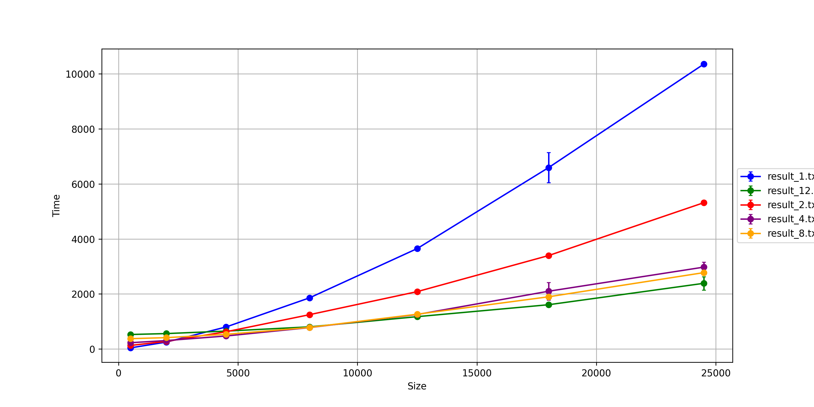

# Лабораторая работа №2

## Задание: 
1. Модифицировать программу из л/р №1 для параллельной работы по технологии OpenMP.

## Характеристики ЭВМ
1. CPU - AMD Ryzen 5 5500U
2. GPU - AMD Radeon Graphics 3.20 GHz
3. RAM 8,0 GB (7,8 GB)

#### Компилятор - msys64

## Результаты: 
1. сгенерированны матрицы в `matrix1_2` разных размеров
2. результат перемножение матриц в `matrix_res`
3. файл статистики: `result.txt`

## Ход работы 
>_OpenMP_ реализует параллельные вычисления с помощью многопоточности, в которой ведущий поток создаёт набор ведомых потоков, и задача распределяется между ними. Предполагается, что потоки выполняются параллельно на машине с несколькими процессорами.

С помощью стандарта __OpenMP__ (Open Multi-Processing)  было реализовано распараллеливание функции умножения матриц

### График 
В результате проведения лабораторной работы была построена следующая зависимость времени выполнения от количества элементов 

[Ссылка на файл с данными](lab_2\\files\\result)

## Выводы
 Таким образом, я могу сделать вывод, что стандарт _OpenMP_ позволил ускорить исследуемую операцию. Каждый поток работает над своей частью результирующей матрицы, что позволяет эффективнее использовать вычислительные ресурсы и уменьшить время выполнения операции умножения.

