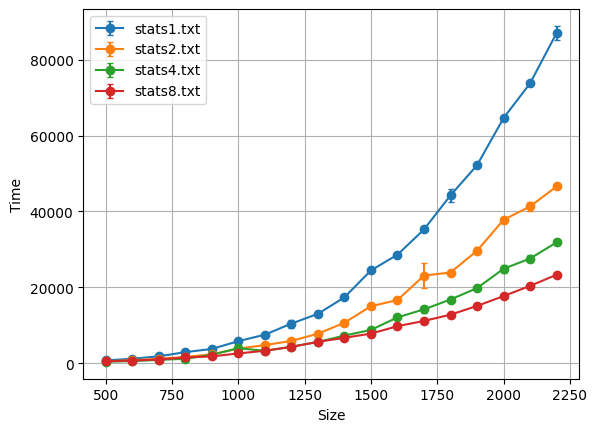

# Лабораторная работа №3

## Задание
1. Модифицировать программу из лабораторной работы №1 для параллельной работы с использованием технологии MPI.

## Характеристики ЭВМ
1. CPU - AMD Ryzen 5 5500U
2. GPU - AMD Radeon Graphics 3.20 GHz
3. RAM 8,0 GB (7,8 GB)

## Результаты
[Исходный код](https://github.com/RYTpL/parallel/tree/main/lab2)
1. Исходные файлы с матрицами: "matrix1.txt", "matrix2.txt"
2. Результат перемножения: "res_cpp.txt"
3. Файлы статистики: stats1.txt, stats2.txt, stats4.txt, stats8.txt
4. Скрипты PBS, подтверждающие запуск на суперкомпьютере: [script1](script1.pbs), [script2](script2.pbs), [script4](script4.pbs), [script8](script8.pbs)

### Source.cpp
Данный файл содержит основной блок кода, в котором выполняется считывание матриц из файлов, их перемножение и запись полученной матрицы, а также запись количества элементов и времени выполнения.

### Main.py
В данном файле содержатся функции генерации матриц, проверки перемножения и создания графика, полученного по результатам эксперимента:

1. `def genMatrix(a: int, b: int, c: int, path1: str, path2: str):`
2. `def write_matrix(path: str, mt: np.array):`
3. `def read_matrix(path: str) -> np.array:`

### График
В результате проведения лабораторной работы была построена зависимость времени выполнения от количества элементов:

Количество потоков:
1. [1 поток](file/stats/stats1.txt)
2. [2 потока](file/stats/stats2.txt)
3. [4 потока](file/stats/stats4.txt)
4. [8 потоков](file/stats/stats8.txt)

## Выводы
На основании полученных результатов можно сделать вывод, что использование технологии _MPI_ позволяет значительно ускорить выполнение исследуемой операции. Каждый процесс обрабатывает свою часть результирующей матрицы, что позволяет более эффективно использовать вычислительные ресурсы и уменьшить время выполнения умножения. Увеличение количества потоков положительно сказывается на производительности.